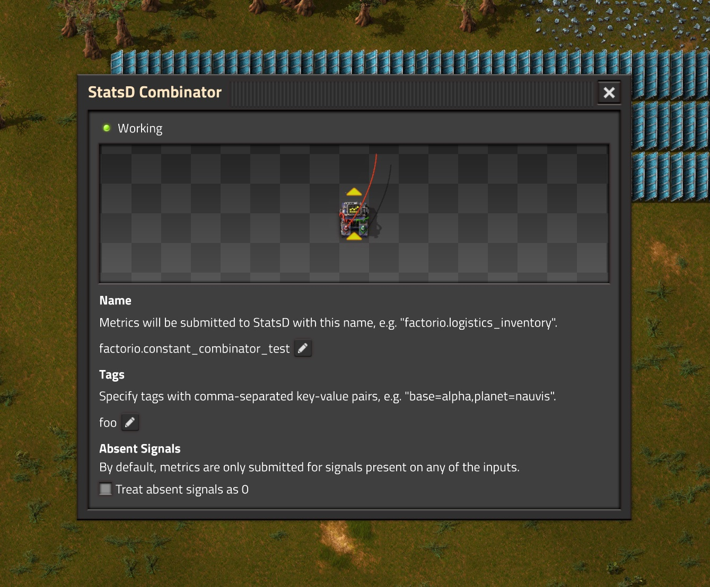
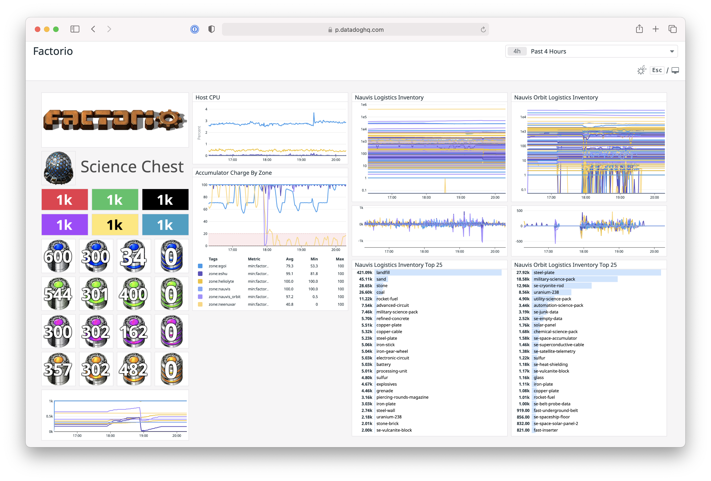

# factorystatsd

factorystatsd is a Factorio mod that allows you to forward metrics to statsd. In the spirit of factory building games, it provides a primitive yet powerful building block: the StatsD Combinator.

## Getting Started with Datadog

Datadog can be used to build professional monitoring and alerting for your factory. The free trial can be used with no hoops or credit card required.

### Install the Datadog Agent

Head over to [Datadog HQ](https://app.datadoghq.com) and create an account. Then follow the onboarding steps to install the Datadog agent.

The Datadog agent runs in the background and listens for metrics sent to it via the StatsD protocol.

### Install the Mod

Install factorystatsd like any other mode: Use the Factorio menu or download it and drop it into the mods subdirectory.

### Run the Forwarder

Factorio mods can't communicate with the agent directly. Instead, factorystatsd writes metrics to the filesystem, and a forwarder must be used to bridge the gap.

Inside the mod directory or zip file, there is a script named "forwarder.py". Install Python, then run it with the `--help` argument to see the available options. The most important ones are `--factorio-script-output` and `--statsd-flavor`:

* `--factorio-script-output` must be the path to your game's script-output directory. If you run forwarder.py from your mod's installation directory, this is determined automatically. Otherwise you'll need to provide it.
* `--statsd-flavor` can be used to tell the forwarder what StatsD extensions it's allowed to use. For Datadog tags to work, you must set this to "dogstatsd".

### Build Some Dashboards

Play the game and send some signals to the StatsD combinator. You should then be able to find your metrics in Datadog! :tada:

